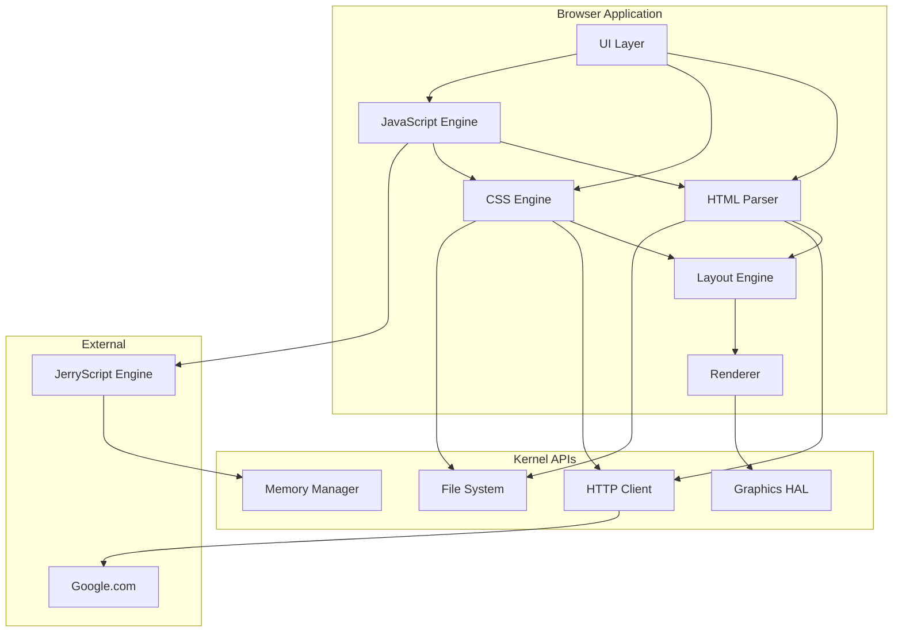

# Camel OS Browser Enhancement Plan

## Overview

This plan outlines the improvements to the Camel OS browser, focusing on:
1. Enhanced HTML/CSS visualization
2. Google search integration as default
3. JerryScript JavaScript engine integration
4. Improved CSS engine

## Current State Analysis

### Browser (`usr/apps/browser_cdl.c`)
- **Lines of code**: ~1987 lines
- **Memory constraints**: MAX_CONTENT=32000, MAX_DOM_NODES=256
- **HTML Parser**: State machine parser supporting basic tags
- **CSS Support**: Inline styles, basic properties (color, margin, padding, flexbox)
- **HTTP Client**: HTTP/1.0 via `core/http.c`
- **Features**: Tabs, history, cache, basic layout engine

### Limitations Identified
1. No JavaScript execution
2. Limited CSS selector support (no class/id selectors)
3. No box model rendering (borders, backgrounds)
4. No default search engine
5. Limited text wrapping and layout

---

## Phase 1: HTML/CSS Visualization Improvements

### 1.1 Enhanced Box Model Rendering

**Files to modify**: `usr/apps/browser_cdl.c`

```
Current: Text runs only render text with basic styling
Target: Full box model with backgrounds, borders, padding
```

**Tasks**:
- [ ] Add border rendering (top, right, bottom, left)
- [ ] Implement background color fill for block elements
- [ ] Add border-radius rendering (rounded corners)
- [ ] Implement proper z-index stacking
- [ ] Add box shadow support (optional)

### 1.2 Improved Text Layout

**Tasks**:
- [ ] Implement proper line-height calculation
- [ ] Add text-align: justify support
- [ ] Improve word wrapping algorithm
- [ ] Add overflow handling (ellipsis, clip)
- [ ] Support for white-space property

### 1.3 Visual Element Rendering

**Tasks**:
- [ ] Render form elements (input, button, textarea)
- [ ] Improve link styling with hover states
- [ ] Add visited link color tracking
- [ ] Render horizontal rules with CSS styling
- [ ] Add list markers (bullet points, numbers)

### 1.4 Table Rendering

**Tasks**:
- [ ] Implement table layout algorithm
- [ ] Add border-collapse support
- [ ] Render table headers distinctly
- [ ] Support colspan/rowspan attributes

---

## Phase 2: Google Search Integration

### 2.1 Default Homepage

**Files to modify**: `usr/apps/browser_cdl.c`

**Tasks**:
- [ ] Change `nav_home()` to navigate to `https://www.google.com`
- [ ] Add startup page configuration
- [ ] Create welcome page with search focus

### 2.2 Search Bar Implementation

**Tasks**:
- [ ] Add dedicated search input in toolbar
- [ ] Implement URL detection vs search query
- [ ] Encode search terms for URL
- [ ] Navigate to `https://www.google.com/search?q=<query>`

### 2.3 URL Bar Enhancements

**Tasks**:
- [ ] Add search suggestions (optional, requires API)
- [ ] Support for multiple search engines
- [ ] Add search shortcuts (e.g., `g <query>` for Google)

---

## Phase 3: JerryScript JavaScript Engine Integration

### 3.1 JerryScript Porting

**Files to create**: `usr/libs/jerry/`

JerryScript is a lightweight JavaScript engine designed for IoT and embedded systems:
- **Size**: ~80KB compiled
- **Memory**: ~4KB minimum heap
- **Language**: C99 compatible

**Tasks**:
- [ ] Clone JerryScript repository
- [ ] Create Camel OS port layer
- [ ] Implement required OS interfaces:
  - Memory allocation (kmalloc/kfree)
  - Date/time functions
  - File I/O stubs
- [ ] Configure build for minimal footprint
- [ ] Create CDL library wrapper

### 3.2 Browser JavaScript Bindings

**Files to create**: `usr/apps/browser_js.c`

**Tasks**:
- [ ] Implement `console.log()` binding
- [ ] Implement `document.getElementById()`
- [ ] Implement `document.querySelector()` (basic)
- [ ] Implement element manipulation:
  - `element.innerHTML`
  - `element.style`
  - `element.textContent`
- [ ] Implement event handling:
  - `onclick`
  - `onload`
- [ ] Implement `window.location`

### 3.3 JavaScript Execution Pipeline

**Tasks**:
- [ ] Extract `<script>` content during HTML parsing
- [ ] Execute scripts after DOM ready
- [ ] Handle inline and external scripts
- [ ] Implement script error handling
- [ ] Add script timeout protection

### 3.4 Memory Management

**Tasks**:
- [ ] Allocate JerryScript heap from system memory
- [ ] Implement garbage collection triggers
- [ ] Monitor memory usage
- [ ] Handle out-of-memory gracefully

---

## Phase 4: Enhanced CSS Engine

### 4.1 CSS Selector Support

**Files to modify**: `usr/apps/browser_cdl.c`

**Tasks**:
- [ ] Implement class selector (`.classname`)
- [ ] Implement ID selector (`#idname`)
- [ ] Implement descendant selector (`div p`)
- [ ] Implement child selector (`div > p`)
- [ ] Implement multiple selector (`div, p`)

### 4.2 CSS Property Expansion

**Tasks**:
- [ ] Add border properties (width, style, color)
- [ ] Add background-image support (placeholder)
- [ ] Add position property (relative, absolute, fixed)
- [ ] Add overflow property
- [ ] Add visibility property
- [ ] Add cursor property

### 4.3 Style Computation

**Tasks**:
- [ ] Implement CSS specificity calculation
- [ ] Add style inheritance from parent
- [ ] Implement computed style resolution
- [ ] Add !important support
- [ ] Handle CSS variables (optional)

### 4.4 External Stylesheet Support

**Tasks**:
- [ ] Parse `<link rel="stylesheet">` tags
- [ ] Fetch external CSS files via HTTP
- [ ] Cache parsed CSS rules
- [ ] Handle @import statements (basic)

---

## Phase 5: Testing and Optimization

### 5.1 Memory Optimization

**Tasks**:
- [ ] Profile browser memory usage
- [ ] Optimize DOM node allocation
- [ ] Implement text run pooling
- [ ] Add memory pressure handling
- [ ] Test with limited memory scenarios

### 5.2 Performance Testing

**Tasks**:
- [ ] Test page load times
- [ ] Measure JavaScript execution time
- [ ] Test with large HTML documents
- [ ] Benchmark CSS selector matching
- [ ] Profile rendering performance

### 5.3 Compatibility Testing

**Tasks**:
- [ ] Test with popular websites (simplified versions)
- [ ] Test JavaScript snippets
- [ ] Test CSS styling
- [ ] Document supported features
- [ ] Create test suite

---

## Architecture Diagram



---

## File System Impact

### Current disk.img: ~268MB
### Estimated additions:
- JerryScript library: ~100KB
- Browser enhancements: ~50KB
- CSS rules cache: ~10KB
- JavaScript heap: ~64KB (configurable)

**Total additional space needed**: ~224KB

No filesystem expansion required.

---

## Implementation Order

1. **Phase 1.1-1.2**: Box model and text layout (immediate visual improvement)
2. **Phase 2**: Google search integration (quick win)
3. **Phase 4.1-4.2**: CSS selectors and properties (foundation for JS)
4. **Phase 3**: JerryScript integration (major feature)
5. **Phase 1.3-1.4**: Form elements and tables
6. **Phase 4.3-4.4**: Style computation and external CSS
7. **Phase 5**: Testing and optimization

---

## Risk Assessment

| Risk | Impact | Mitigation |
|------|--------|------------|
| JerryScript memory usage | High | Configure minimal heap, add monitoring |
| CSS complexity | Medium | Implement incrementally, test often |
| JavaScript security | High | Sandbox execution, limit API access |
| Performance degradation | Medium | Profile early, optimize hot paths |
| Breaking existing functionality | High | Maintain backward compatibility |

---

## Success Criteria

1. Browser renders HTML with proper box model
2. Google search works as default homepage
3. Basic JavaScript executes (console.log, DOM manipulation)
4. CSS class and ID selectors work
5. Memory usage stays under 1MB for typical pages
6. Page load time under 5 seconds for simple pages
