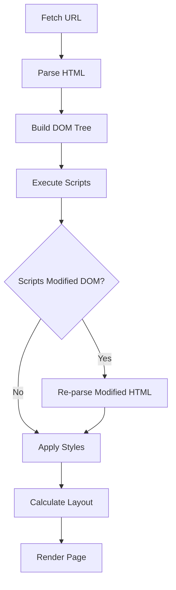
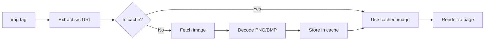
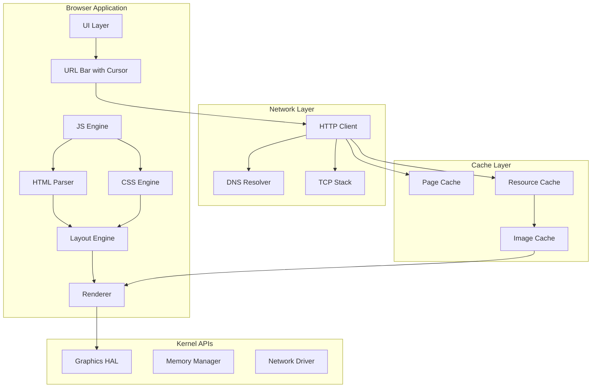

# Camel OS Browser Improvements Plan

## Executive Summary

This plan addresses six critical issues in the Camel OS browser:
1. Google website not rendering properly (only shows title, no input/buttons)
2. CSS centering issues (example.com not centered)
3. Caching/buffering for images and resources
4. Proper img tag handling with image loading
5. Text cursor with arrow key navigation
6. Screen freeze during HTTP requests

---

## Current State Analysis

### Browser Architecture ([`usr/apps/browser_cdl.c`](usr/apps/browser_cdl.c))

```
┌─────────────────────────────────────────────────────────────┐
│                    Browser Application                       │
├─────────────────────────────────────────────────────────────┤
│  ┌──────────┐  ┌──────────┐  ┌──────────┐  ┌──────────┐    │
│  │   HTML   │  │   CSS    │  │   DOM    │  │  Layout  │    │
│  │  Parser  │──│  Engine  │──│  Builder │──│  Engine  │    │
│  └──────────┘  └──────────┘  └──────────┘  └──────────┘    │
│        │              │             │              │        │
│        ▼              ▼             ▼              ▼        │
│  ┌──────────────────────────────────────────────────────┐  │
│  │              Text/Box Run Renderer                    │  │
│  └──────────────────────────────────────────────────────┘  │
├─────────────────────────────────────────────────────────────┤
│  ┌──────────┐  ┌──────────┐  ┌──────────┐                 │
│  │   HTTP   │  │   Cache  │  │  History │                 │
│  │  Client  │  │  System  │  │  System  │                 │
│  └──────────┘  └──────────┘  └──────────┘                 │
└─────────────────────────────────────────────────────────────┘
```

### JavaScript Engine ([`usr/libs/js_engine.h`](usr/libs/js_engine.h))

The JS engine exists but is **NOT integrated** with the browser:
- Has DOM bindings defined but not connected
- `console.log`, `document.getElementById`, etc. are stubs
- Scripts are currently skipped during HTML parsing (line 1249-1252)

### HTTP Client ([`core/http.c`](core/http.c))

- Synchronous blocking implementation
- No progress callbacks
- No async operation support

---

## Issue 1: Google Website Not Rendering

### Root Cause
Google's homepage uses JavaScript to render the search box and buttons. The HTML returned from google.com contains minimal static content - the actual UI is built dynamically via JS.

### Analysis of Google's Homepage
```html
<!-- Simplified Google response -->
<html>
  <head><title>Google</title></head>
  <body>
    <script>
      // JavaScript builds the entire UI here
      document.write('<input type="text">...');
    </script>
  </body>
</html>
```

### Solution: JavaScript Integration

#### Step 1.1: Connect JS Engine to Browser
**File:** [`usr/apps/browser_cdl.c`](usr/apps/browser_cdl.c)

```c
// Add after HTML parsing, before layout
static js_engine_t js_engine;

void execute_scripts() {
    // Find all script nodes in DOM
    dom_node_t* node = document;
    while (node) {
        if (node->elem_type == ELEM_SCRIPT && node->text_content) {
            js_eval(&js_engine, node->text_content);
        }
        // Traverse DOM...
    }
}
```

#### Step 1.2: Implement DOM Bindings
**File:** [`usr/libs/js_engine.c`](usr/libs/js_engine.c)

```c
// document.getElementById implementation
js_value_t* js_document_getElementById(int argc, js_value_t** args) {
    if (argc < 1) return js_new_null(&js_engine);
    
    const char* id = args[0]->data.string;
    dom_node_t* node = find_node_by_id(document, id);
    
    if (!node) return js_new_null(&js_engine);
    
    // Return wrapped DOM element
    js_value_t* elem = js_new_object(&js_engine);
    js_object_set(&js_engine, elem, "_dom_ptr", 
                  js_new_number(&js_engine, (int)node));
    return elem;
}

// element.innerHTML setter
js_value_t* js_element_setInnerHTML(int argc, js_value_t** args) {
    // Get DOM node from element object
    // Parse HTML and insert into DOM
    // Trigger re-layout
}
```

#### Step 1.3: Script Execution Pipeline
**File:** [`usr/apps/browser_cdl.c`](usr/apps/browser_cdl.c)



### Implementation Tasks
- [ ] Initialize JS engine in browser startup
- [ ] Extract script content during HTML parsing
- [ ] Implement `document.write()` for dynamic content
- [ ] Implement `document.getElementById()`
- [ ] Implement `element.innerHTML` getter/setter
- [ ] Implement `document.createElement()`
- [ ] Implement `element.appendChild()`
- [ ] Add script execution after DOM ready
- [ ] Handle multiple script tags in order

---

## Issue 2: CSS Centering Issues

### Root Cause
The layout engine doesn't properly handle:
1. `margin: auto` for horizontal centering
2. `justify-content: center` in flexbox
3. `text-align: center` on block elements

### Current Layout Code Analysis
**File:** [`usr/apps/browser_cdl.c`](usr/apps/browser_cdl.c:1600-1878)

The `layout_dom()` function:
- Calculates x position from left only
- No centering logic for auto margins
- Flexbox properties are parsed but not applied

### Solution: Enhanced Layout Engine

#### Step 2.1: Implement Auto Margin Centering
```c
// In layout_dom(), when processing block elements:
if (node->style.margin_left == MARGIN_AUTO && 
    node->style.margin_right == MARGIN_AUTO) {
    int element_width = calculate_element_width(node);
    int available_width = content_width - element_width;
    if (available_width > 0) {
        node->x = available_width / 2;
    }
}
```

#### Step 2.2: Implement Flexbox Centering
```c
// Apply justify-content for flex containers
void apply_flex_layout(dom_node_t* container) {
    int total_width = 0;
    int child_count = 0;
    
    // Calculate total children width
    dom_node_t* child = container->first_child;
    while (child) {
        total_width += child->width;
        child_count++;
        child = child->next_sibling;
    }
    
    int gap = container->style.gap * (child_count - 1);
    total_width += gap;
    
    int start_x = 0;
    switch (container->style.justify_content) {
        case JUSTIFY_CENTER:
            start_x = (container->width - total_width) / 2;
            break;
        case JUSTIFY_FLEX_END:
            start_x = container->width - total_width;
            break;
        case JUSTIFY_SPACE_BETWEEN:
            // Distribute space between items
            break;
    }
    
    // Position children
    child = container->first_child;
    int x = start_x;
    while (child) {
        child->x = x;
        x += child->width + container->style.gap;
        child = child->next_sibling;
    }
}
```

#### Step 2.3: Add MARGIN_AUTO Constant
```c
#define MARGIN_AUTO -1  // Special value for auto margins

// In parse_inline_style():
if (str_casecmp(value, "auto") == 0) {
    style->margin_left = MARGIN_AUTO;
    style->margin_right = MARGIN_AUTO;
}
```

### Implementation Tasks
- [ ] Add `MARGIN_AUTO` constant and parsing
- [ ] Implement horizontal centering with auto margins
- [ ] Implement flexbox `justify-content` centering
- [ ] Implement flexbox `align-items` centering
- [ ] Add `margin: 0 auto` shorthand support
- [ ] Test with example.com centering

---

## Issue 3: Caching/Buffering for Images

### Current Cache System
**File:** [`usr/apps/browser_cdl.c`](usr/apps/browser_cdl.c:213-437)

The current cache only stores:
- URL
- Title
- Content length
- Timestamp

**Missing:** Actual content storage and image caching

### Solution: Enhanced Resource Cache

#### Step 3.1: Resource Cache Structure
```c
typedef enum {
    CACHE_HTML,
    CACHE_CSS,
    CACHE_IMAGE,
    CACHE_JS
} resource_type_t;

typedef struct {
    char url[MAX_URL];
    resource_type_t type;
    uint8_t* data;          // Actual content data
    int data_len;
    uint32_t timestamp;
    int valid;
    int ref_count;          // For shared resources
} resource_cache_t;

#define MAX_RESOURCE_CACHE 32
static resource_cache_t resource_cache[MAX_RESOURCE_CACHE];
```

#### Step 3.2: Image Cache with Decoded Data
```c
typedef struct {
    char url[MAX_URL];
    uint8_t* pixel_data;    // Decoded RGBA pixels
    int width;
    int height;
    int valid;
    uint32_t last_used;
} image_cache_t;

#define MAX_IMAGE_CACHE 8
static image_cache_t image_cache[MAX_IMAGE_CACHE];
```

#### Step 3.3: Cache Implementation
```c
resource_cache_t* cache_resource(const char* url, resource_type_t type,
                                  const uint8_t* data, int len) {
    // Find free slot or evict oldest
    int slot = find_cache_slot();
    
    resource_cache_t* entry = &resource_cache[slot];
    sys->strcpy(entry->url, url);
    entry->type = type;
    entry->data = sys->malloc(len);
    if (entry->data) {
        sys->memcpy(entry->data, data, len);
        entry->data_len = len;
    }
    entry->timestamp = sys->get_ticks();
    entry->valid = 1;
    entry->ref_count = 0;
    
    return entry;
}

uint8_t* cache_get_resource(const char* url, int* out_len) {
    for (int i = 0; i < MAX_RESOURCE_CACHE; i++) {
        if (resource_cache[i].valid && 
            sys->strcmp(resource_cache[i].url, url) == 0) {
            *out_len = resource_cache[i].data_len;
            resource_cache[i].ref_count++;
            return resource_cache[i].data;
        }
    }
    return NULL;
}
```

### Implementation Tasks
- [ ] Create resource cache structure
- [ ] Implement `cache_resource()` function
- [ ] Implement `cache_get_resource()` function
- [ ] Add image-specific cache with decoded pixels
- [ ] Implement LRU eviction policy
- [ ] Add cache size limits
- [ ] Persist cache to disk (optional)

---

## Issue 4: Proper img Tag Handling

### Current Implementation
**File:** [`usr/apps/browser_cdl.c`](usr/apps/browser_cdl.c:1759-1776)

```c
// Current: Just shows [alt text] placeholder
if (node->elem_type == ELEM_IMG) {
    if (text_run_count < MAX_TEXT_RUNS) {
        text_run_t* run = &text_runs[text_run_count++];
        run->text[0] = '[';
        // ... copies alt text ...
    }
}
```

### Solution: Full Image Support

#### Step 4.1: Image Loading Pipeline


#### Step 4.2: Image Node Structure
```c
typedef struct {
    char src[MAX_URL];
    char alt[128];
    int width;
    int height;
    int natural_width;
    int natural_height;
    uint8_t* pixel_data;    // Decoded RGBA
    int loaded;
    int load_error;
} image_data_t;

// Add to dom_node_t
typedef struct dom_node {
    // ... existing fields ...
    image_data_t* image_data;  // For IMG elements
};
```

#### Step 4.3: Image Fetching
```c
void fetch_image(dom_node_t* img_node) {
    const char* src = img_node->src;
    if (!src || !src[0]) return;
    
    // Resolve relative URLs
    char full_url[MAX_URL];
    resolve_url(src, current_url, full_url);
    
    // Check cache first
    image_cache_t* cached = image_cache_find(full_url);
    if (cached) {
        img_node->image_data->pixel_data = cached->pixel_data;
        img_node->image_data->width = cached->width;
        img_node->image_data->height = cached->height;
        img_node->image_data->loaded = 1;
        return;
    }
    
    // Fetch image data
    uint8_t* img_data = sys->malloc(MAX_IMAGE_SIZE);
    int len = sys->http_get(full_url, img_data, MAX_IMAGE_SIZE);
    
    if (len > 0) {
        // Decode image
        int w, h;
        uint8_t* pixels = decode_image(img_data, len, &w, &h);
        if (pixels) {
            img_node->image_data->pixel_data = pixels;
            img_node->image_data->width = w;
            img_node->image_data->height = h;
            img_node->image_data->loaded = 1;
            
            // Cache the decoded image
            image_cache_add(full_url, pixels, w, h);
        }
    }
    
    sys->free(img_data);
}
```

#### Step 4.4: Image Rendering
```c
void render_image(dom_node_t* node, int x, int y) {
    image_data_t* img = node->image_data;
    if (!img || !img->loaded) {
        // Show placeholder
        render_image_placeholder(node, x, y);
        return;
    }
    
    // Apply CSS sizing
    int render_w = img->width;
    int render_h = img->height;
    
    if (node->style.width > 0) render_w = node->style.width;
    if (node->style.height > 0) render_h = node->style.height;
    
    // Render pixels
    for (int py = 0; py < render_h; py++) {
        for (int px = 0; px < render_w; px++) {
            int src_x = px * img->width / render_w;
            int src_y = py * img->height / render_h;
            uint8_t* pixel = &img->pixel_data[(src_y * img->width + src_x) * 4];
            
            uint32_t color = (pixel[3] << 24) | (pixel[0] << 16) | 
                            (pixel[1] << 8) | pixel[2];
            
            sys->draw_pixel(x + px, y + py, color);
        }
    }
}
```

#### Step 4.5: Simple PNG Decoder
```c
// Minimal PNG decoder for browser
uint8_t* decode_png(const uint8_t* data, int len, int* width, int* height) {
    // Check PNG signature
    if (data[0] != 0x89 || data[1] != 'P' || 
        data[2] != 'N' || data[3] != 'G') {
        return NULL;
    }
    
    // Parse IHDR chunk for dimensions
    // Parse IDAT chunk for pixel data
    // Apply zlib decompression
    // Apply PNG filtering
    
    // For simplicity, also support BMP which is easier:
    return decode_bmp(data, len, width, height);
}
```

### Implementation Tasks
- [ ] Add `image_data_t` structure to DOM nodes
- [ ] Implement `fetch_image()` function
- [ ] Implement simple BMP decoder (easier than PNG)
- [ ] Implement basic PNG decoder
- [ ] Add image rendering in `on_paint()`
- [ ] Handle image sizing from CSS
- [ ] Show loading placeholder while fetching
- [ ] Handle image load errors gracefully

---

## Issue 5: Text Cursor with Arrow Key Navigation

### Current Input Handling
**File:** [`usr/apps/browser_cdl.c`](usr/apps/browser_cdl.c:2085-2134)

```c
void on_input(int key) {
    int len = sys->strlen(current_url);
    
    switch (key) {
        case '\b':
            current_url[len - 1] = 0;  // Only deletes from end
            break;
        // No cursor movement handling
    }
}
```

### Solution: Cursor Management System

#### Step 5.1: Cursor State Structure
```c
typedef struct {
    char text[MAX_URL];
    int length;
    int cursor_pos;         // Current cursor position (0 to length)
    int selection_start;    // For text selection (-1 = no selection)
    int selection_end;
} text_input_t;

static text_input_t url_input;
```

#### Step 5.2: Cursor Movement Functions
```c
void cursor_move_left(text_input_t* input) {
    if (input->cursor_pos > 0) {
        input->cursor_pos--;
    }
}

void cursor_move_right(text_input_t* input) {
    if (input->cursor_pos < input->length) {
        input->cursor_pos++;
    }
}

void cursor_move_home(text_input_t* input) {
    input->cursor_pos = 0;
}

void cursor_move_end(text_input_t* input) {
    input->cursor_pos = input->length;
}

void cursor_delete_char(text_input_t* input) {
    if (input->cursor_pos < input->length) {
        // Shift characters left
        for (int i = input->cursor_pos; i < input->length; i++) {
            input->text[i] = input->text[i + 1];
        }
        input->length--;
        input->text[input->length] = 0;
    }
}

void cursor_backspace(text_input_t* input) {
    if (input->cursor_pos > 0) {
        cursor_move_left(input);
        cursor_delete_char(input);
    }
}

void cursor_insert_char(text_input_t* input, char c) {
    if (input->length < MAX_URL - 1) {
        // Shift characters right
        for (int i = input->length; i > input->cursor_pos; i--) {
            input->text[i] = input->text[i - 1];
        }
        input->text[input->cursor_pos] = c;
        input->cursor_pos++;
        input->length++;
        input->text[input->length] = 0;
    }
}
```

#### Step 5.3: Updated Input Handler
```c
void on_input(int key) {
    switch (key) {
        case '\n':
            navigate(url_input.text);
            break;
            
        case '\b':
            cursor_backspace(&url_input);
            break;
            
        case 0x01: // Ctrl+A - Select All
            url_input.selection_start = 0;
            url_input.selection_end = url_input.length;
            break;
            
        case 0x25: // Left arrow
            cursor_move_left(&url_input);
            return;
            
        case 0x27: // Right arrow
            cursor_move_right(&url_input);
            return;
            
        case 0x24: // Home
            cursor_move_home(&url_input);
            return;
            
        case 0x23: // End
            cursor_move_end(&url_input);
            return;
            
        case 0x2E: // Delete
            cursor_delete_char(&url_input);
            return;
            
        default:
            if (key >= 32 && key <= 126) {
                cursor_insert_char(&url_input, (char)key);
            }
            break;
    }
}
```

#### Step 5.4: Cursor Rendering
```c
void render_url_bar(int x, int y, int w) {
    // Draw background
    sys->draw_rect(x, y, w, 24, 0xFFFFFFFF);
    
    // Draw text
    sys->draw_text(x + 5, y + 8, url_input.text, 0xFF000000);
    
    // Draw cursor (blinking)
    static int cursor_blink = 0;
    cursor_blink = (cursor_blink + 1) % 30;
    
    if (cursor_blink < 15) {
        int cursor_x = x + 5 + url_input.cursor_pos * 8;
        sys->draw_rect(cursor_x, y + 6, 2, 16, 0xFF000000);
    }
}
```

### Implementation Tasks
- [ ] Create `text_input_t` structure
- [ ] Implement cursor movement functions
- [ ] Update `on_input()` for arrow keys
- [ ] Add cursor rendering with blinking
- [ ] Implement Home/End key support
- [ ] Implement Delete key support
- [ ] Add text selection (optional)
- [ ] Test cursor in URL bar

---

## Issue 6: Screen Freeze During HTTP Requests

### Root Cause
**File:** [`core/http.c`](core/http.c:80-197)

The HTTP client uses blocking I/O:
```c
int http_get(const char* url, char* response, int response_size, ...) {
    // ...
    while (total_received < response_size - 1) {
        int received = k_recvfrom(sockfd, buffer, ...);  // BLOCKS HERE
        // ...
    }
}
```

While waiting for network, the entire UI freezes because:
1. No window updates during fetch
2. No cursor blinking
3. No repaint events processed

### Solution: Asynchronous Loading

#### Step 6.1: Async HTTP Request Structure
```c
typedef enum {
    HTTP_IDLE,
    HTTP_DNS_RESOLVING,
    HTTP_CONNECTING,
    HTTP_SENDING,
    HTTP_RECEIVING,
    HTTP_COMPLETE,
    HTTP_ERROR
} http_state_t;

typedef struct {
    char url[MAX_URL];
    http_state_t state;
    char* response_buffer;
    int response_size;
    int bytes_received;
    int content_length;
    int sockfd;
    uint32_t start_time;
    void (*callback)(void* data, int result);
    void* callback_data;
} http_request_t;
```

#### Step 6.2: Non-blocking HTTP Functions
```c
// Start async HTTP request
http_request_t* http_get_async(const char* url, char* buffer, int size,
                                void (*callback)(void*, int), void* data) {
    http_request_t* req = alloc_request();
    if (!req) return NULL;
    
    sys->strcpy(req->url, url);
    req->response_buffer = buffer;
    req->response_size = size;
    req->bytes_received = 0;
    req->callback = callback;
    req->callback_data = data;
    req->state = HTTP_DNS_RESOLVING;
    req->start_time = sys->get_ticks();
    
    // Start DNS resolution (non-blocking)
    dns_resolve_async(url, req);
    
    return req;
}

// Process pending requests (call from main loop)
void http_process_requests() {
    for (int i = 0; i < MAX_HTTP_REQUESTS; i++) {
        http_request_t* req = &http_requests[i];
        
        switch (req->state) {
            case HTTP_DNS_RESOLVING:
                // Check if DNS complete
                if (dns_is_resolved(req->url)) {
                    req->state = HTTP_CONNECTING;
                    start_connect(req);
                }
                break;
                
            case HTTP_CONNECTING:
                // Check if connected
                if (is_connected(req->sockfd)) {
                    req->state = HTTP_SENDING;
                    send_request(req);
                }
                break;
                
            case HTTP_RECEIVING:
                // Non-blocking receive
                receive_data(req);
                break;
                
            case HTTP_COMPLETE:
            case HTTP_ERROR:
                // Call callback
                if (req->callback) {
                    req->callback(req->callback_data, 
                                  req->state == HTTP_COMPLETE ? 
                                  req->bytes_received : -1);
                }
                req->state = HTTP_IDLE;
                break;
        }
    }
}
```

#### Step 6.3: Browser Integration
```c
// In browser_cdl.c
static http_request_t* current_request = NULL;
static int loading = 0;

void fetch_url_async(const char* url) {
    sys->strcpy(status, "Loading...");
    loading = 1;
    
    current_request = http_get_async(url, page_content, MAX_CONTENT,
                                      on_load_complete, NULL);
}

void on_load_complete(void* data, int result) {
    loading = 0;
    
    if (result > 0) {
        content_len = result;
        parse_html(page_content);
        layout_dom(780, 500);
        sys->strcpy(status, "Done");
    } else {
        sys->strcpy(status, "Error loading page");
    }
}

// In main loop (called from window server)
void browser_update() {
    if (loading) {
        http_process_requests();
        
        // Update loading animation
        static int dots = 0;
        dots = (dots + 1) % 4;
        sys->strcpy(status, "Loading");
        for (int i = 0; i < dots; i++) {
            str_cat(status, ".");
        }
    }
}
```

#### Step 6.4: Main Loop Integration
```c
// In window_server.c or main event loop
void main_loop() {
    while (1) {
        // Process network
        http_process_requests();
        
        // Process input
        process_keyboard();
        process_mouse();
        
        // Update windows
        for each window:
            if (window->update_callback):
                window->update_callback();
        
        // Render
        render_all_windows();
        
        // Small delay
        sleep(16);  // ~60 FPS
    }
}
```

### Implementation Tasks
- [ ] Create `http_request_t` structure
- [ ] Implement `http_get_async()` function
- [ ] Implement `http_process_requests()` function
- [ ] Add non-blocking socket operations
- [ ] Update browser to use async loading
- [ ] Add loading animation/progress bar
- [ ] Handle request timeouts
- [ ] Test with slow network conditions

---

## Implementation Priority

### Phase 1: Critical Fixes (Immediate)
1. **Screen freeze fix** - Async HTTP loading
2. **Text cursor** - Basic arrow key navigation

### Phase 2: Core Features
3. **CSS centering** - Fix layout engine
4. **Image handling** - Basic BMP/PNG support

### Phase 3: Advanced Features
5. **JavaScript integration** - Dynamic content
6. **Resource caching** - Full cache system

---

## Architecture Diagram



---

## Testing Strategy

### Test Cases

1. **Google Homepage**
   - Navigate to google.com
   - Verify search box appears
   - Verify buttons are clickable

2. **Example.com Centering**
   - Navigate to example.com
   - Verify content is centered
   - Check various viewport sizes

3. **Image Loading**
   - Navigate to page with images
   - Verify images render correctly
   - Test image caching (reload page)

4. **Cursor Navigation**
   - Type in URL bar
   - Use arrow keys to move cursor
   - Insert/delete at cursor position

5. **Async Loading**
   - Navigate to slow-loading page
   - Verify UI remains responsive
   - Check loading indicator

---

## Risk Assessment

| Risk | Impact | Mitigation |
|------|--------|------------|
| JS engine memory usage | High | Limit heap size, add monitoring |
| Image decoder complexity | Medium | Start with BMP, add PNG later |
| Async HTTP race conditions | High | Proper state machine, timeouts |
| Cache memory exhaustion | Medium | LRU eviction, size limits |
| Breaking existing functionality | High | Incremental changes, testing |

---

## Success Criteria

1. Google homepage renders with search box and buttons
2. Example.com content is properly centered
3. Images load and display correctly
4. Cursor is visible and movable with arrow keys
5. UI remains responsive during page loads
6. Memory usage stays under 2MB for typical pages
7. Page load time under 5 seconds for simple pages
