# Camel OS Architecture Diagrams

## Current System Architecture

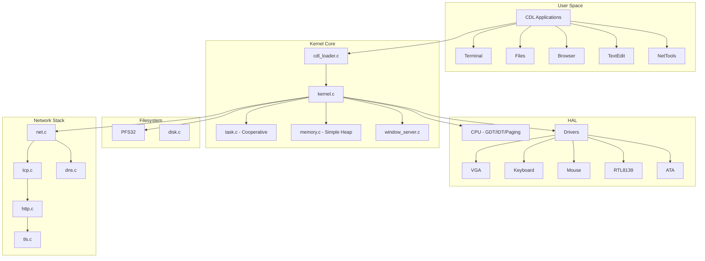

## Proposed System Architecture

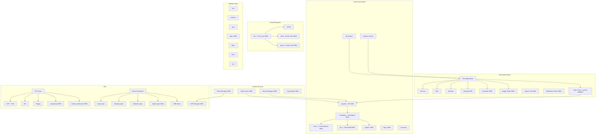

## Process Lifecycle State Machine

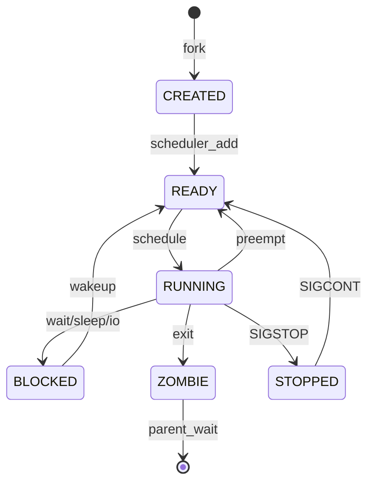

## Memory Management Architecture

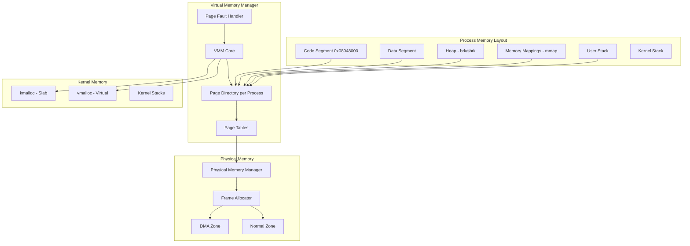

## IPC Mechanisms

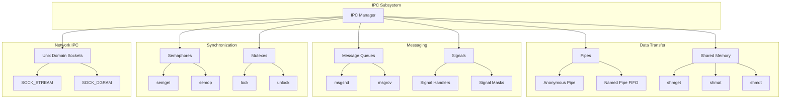

## Window System Architecture

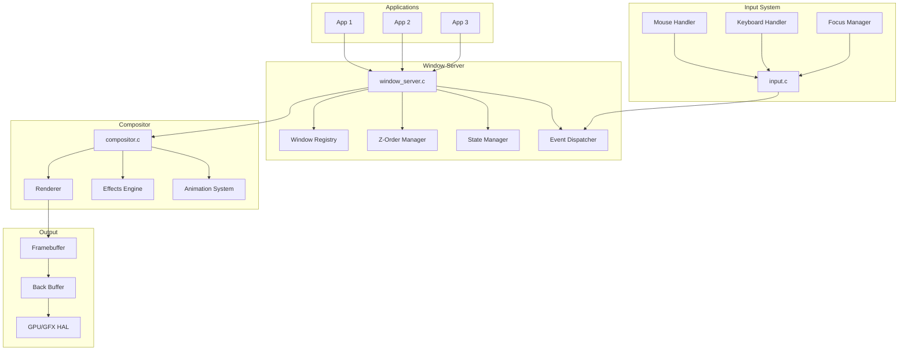

## Network Stack Architecture

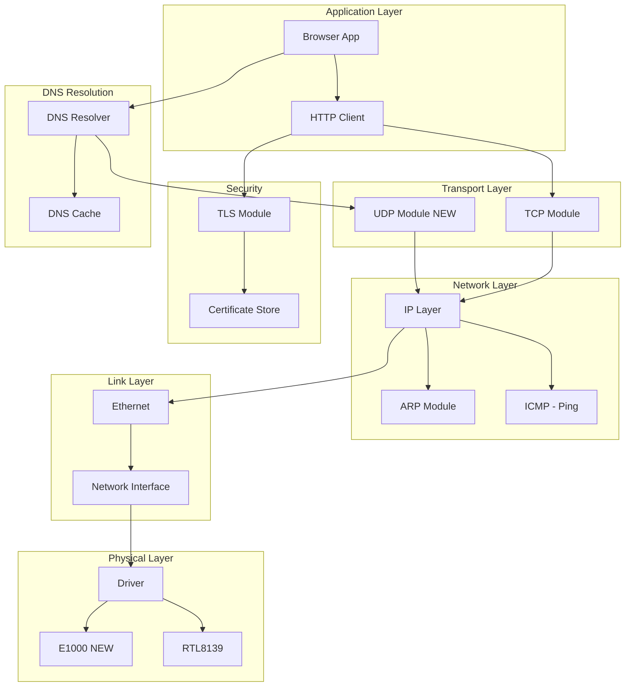

## Driver Architecture

```mermaid
graph TB
    subgraph Device Manager
        DEVMGR[Device Manager NEW]
        DTREE[Device Tree]
        DRVREG[Driver Registry]
    end

    subgraph Bus Drivers
        PCI[PCI Driver]
        USB[USB Core]
        ISA[ISA/Legacy]
    end

    subgraph USB Stack
        XHCI[xHCI - USB 3.0]
        EHCI[EHCI - USB 2.0 NEW]
        UHCI[UHCI - USB 1.1 NEW]
        
        USBHID[HID Driver NEW]
        USBMS[Mass Storage NEW]
        USBAUDIO[Audio Class NEW]
    end

    subgraph Storage Class
        ATA[ATA/IDE]
        AHCI[AHCI/SATA NEW]
        NVMe[NVMe NEW]
        SDHCI[SD Card NEW]
    end

    subgraph Network Class
        RTL8139[RTL8139]
        RTL8169[RTL8169]
        E1000[Intel E1000 NEW]
        VIRTIO[VirtIO NEW]
    end

    subgraph Audio Class
        SB16[Sound Blaster 16]
        HDA[Intel HDA NEW]
        AC97[AC97 NEW]
    end

    subgraph Input Class
        KEYBOARD[Keyboard]
        MOUSE[Mouse]
        TABLET[Tablet NEW]
    end

    subgraph Display Class
        VGA[VGA]
        BOCHS[Bochs/QEMU]
        VBE[VBE LFB]
    end

    DEVMGR --> DTREE
    DEVMGR --> DRVREG
    
    DEVMGR --> PCI
    DEVMGR --> USB
    DEVMGR --> ISA
    
    USB --> XHCI
    USB --> EHCI
    USB --> UHCI
    USB --> USBHID
    USB --> USBMS
    USB --> USBAUDIO
    
    DEVMGR --> ATA
    DEVMGR --> AHCI
    DEVMGR --> NVMe
    DEVMGR --> SDHCI
    
    DEVMGR --> RTL8139
    DEVMGR --> RTL8169
    DEVMGR --> E1000
    DEVMGR --> VIRTIO
    
    DEVMGR --> SB16
    DEVMGR --> HDA
    DEVMGR --> AC97
    
    DEVMGR --> KEYBOARD
    DEVMGR --> MOUSE
    DEVMGR --> TABLET
    
    DEVMGR --> VGA
    DEVMGR --> BOCHS
    DEVMGR --> VBE
```

## Service Management Architecture

```mermaid
graph TB
    subgraph Service Manager
        SVC_MGR[Service Manager]
        CONFIG[Service Configs]
        STATE[State Machine]
        DEPS[Dependency Graph]
    end

    subgraph Service Types
        SYSTEM[System Services]
        NETWORK[Network Services]
        DAEMON[Background Daemons]
    end

    subgraph Services
        INIT[Init Service]
        NET_SVC[Network Service]
        AUDIO_SVC[Audio Service]
        POWER_SVC[Power Service]
        LOG_SVC[Logging Service]
        CRON_SVC[Cron Service NEW]
    end

    subgraph Service Lifecycle
        STOPPED[Stopped]
        STARTING[Starting]
        RUNNING[Running]
        STOPPING[Stopping]
        FAILED[Failed]
    end

    SVC_MGR --> CONFIG
    SVC_MGR --> STATE
    SVC_MGR --> DEPS
    
    CONFIG --> SYSTEM
    CONFIG --> NETWORK
    CONFIG --> DAEMON
    
    SYSTEM --> INIT
    NETWORK --> NET_SVC
    DAEMON --> AUDIO_SVC
    DAEMON --> POWER_SVC
    DAEMON --> LOG_SVC
    DAEMON --> CRON_SVC
    
    STATE --> STOPPED
    STATE --> STARTING
    STATE --> RUNNING
    STATE --> STOPPING
    STATE --> FAILED
    
    STOPPED --> STARTING: start
    STARTING --> RUNNING: success
    STARTING --> FAILED: error
    RUNNING --> STOPPING: stop
    STOPPING --> STOPPED: done
    FAILED --> STARTING: restart
```

## Boot Sequence

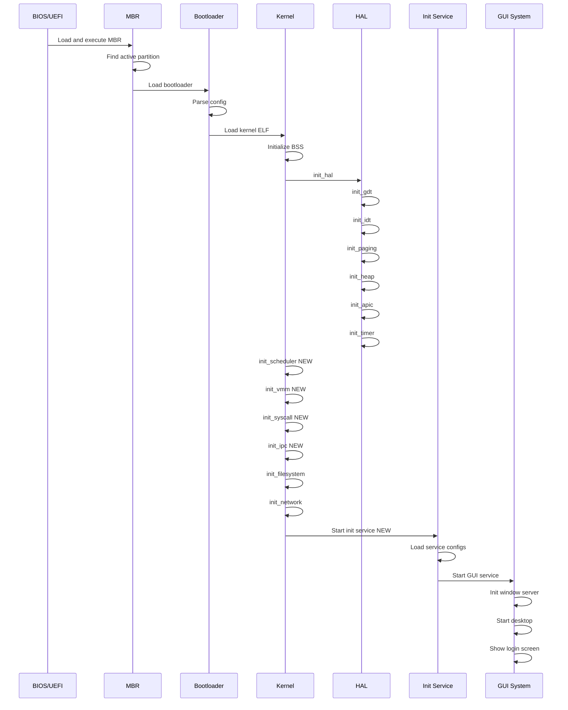

## System Call Flow

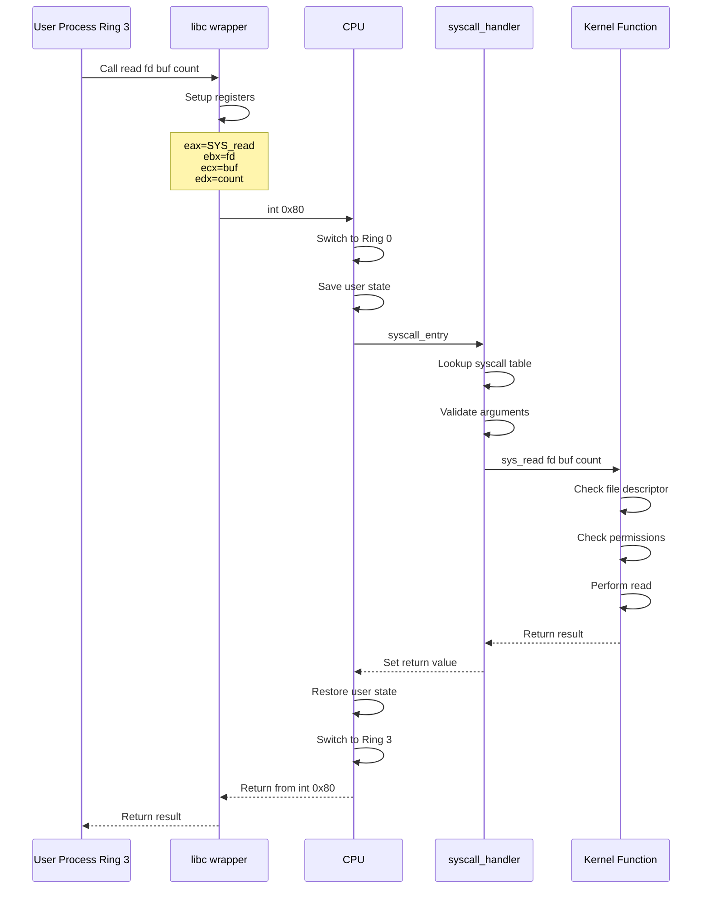

## Desktop Environment Components

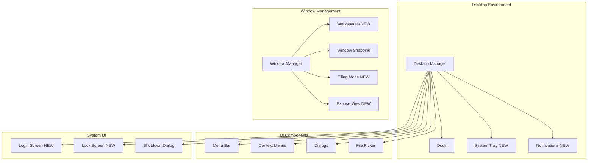

---

## Summary

These architecture diagrams illustrate the proposed improvements to Camel OS across all major subsystems:

1. **Core System**: Preemptive scheduling, virtual memory, IPC, and system calls
2. **User Space**: Ring 3 execution, user libraries, and system services
3. **Hardware**: Enhanced driver framework, USB stack, audio, and power management
4. **User Experience**: Desktop environment, notifications, and workspace management
5. **Security**: User/kernel separation, permission enforcement, and secure boot

The modular design allows incremental implementation while maintaining system stability throughout the development process.