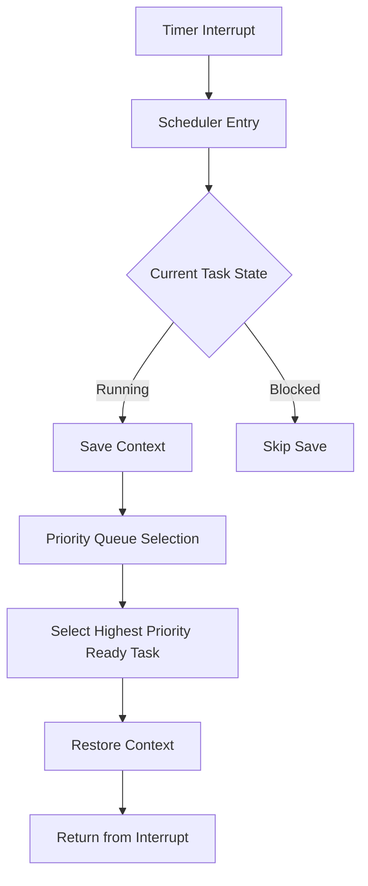
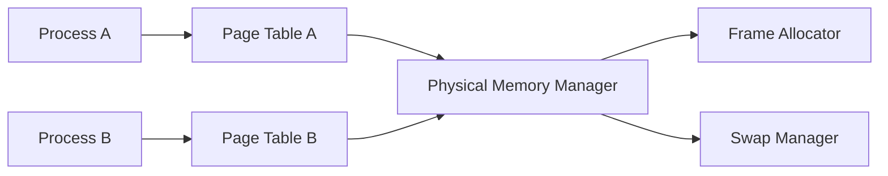
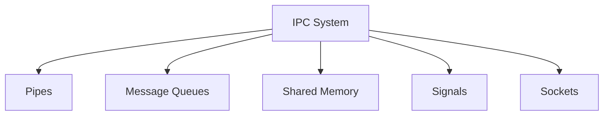
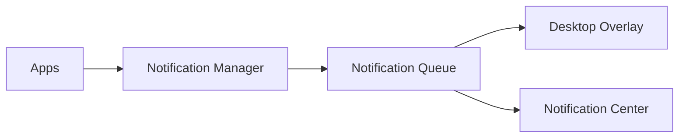
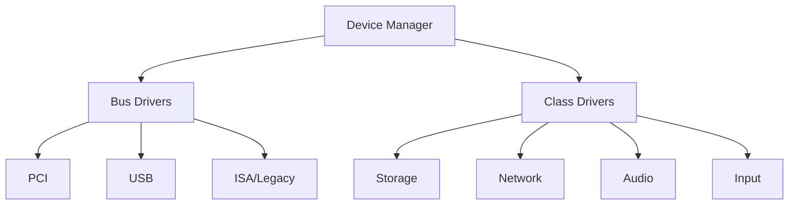
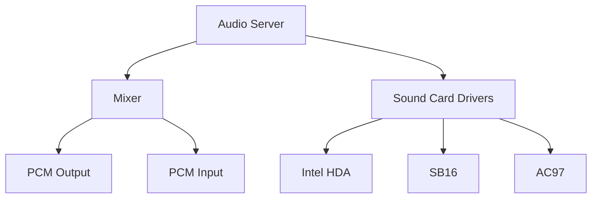
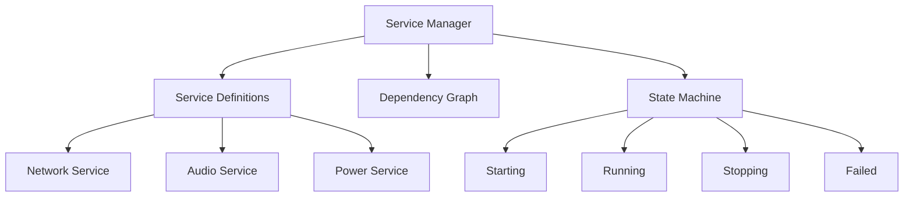
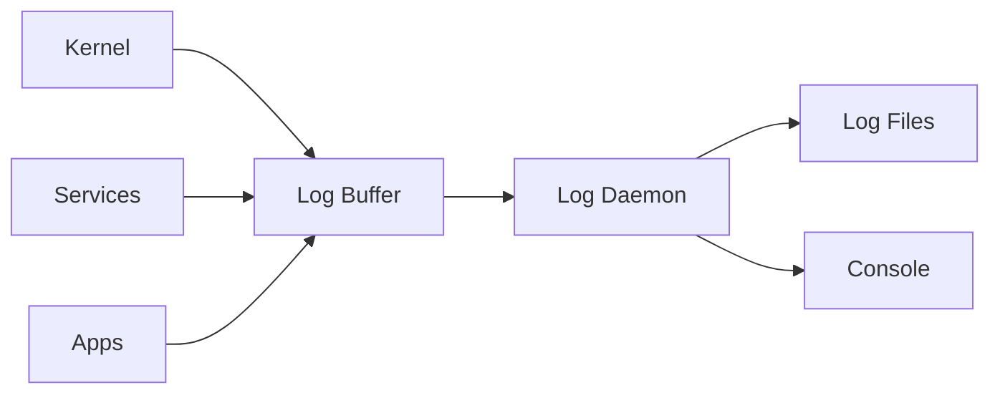

# Camel OS Comprehensive Improvement Plan

## Executive Summary

This document outlines a comprehensive roadmap for improving Camel OS across all major subsystems. The plan is organized into five phases, each building upon the previous to create a robust, feature-rich operating system.

---

## Current State Analysis

### Architecture Overview

```
Camel OS Current Architecture
```

| Component | Status | File Location |
|-----------|--------|---------------|
| Kernel | Monolithic, basic HAL | [`core/kernel.c`](core/kernel.c) |
| Memory | Simple heap, basic paging | [`core/memory.c`](core/memory.c) |
| Tasking | Cooperative, basic TCB | [`core/task.c`](core/task.c) |
| Filesystem | PFS32 custom FS | [`fs/pfs32.c`](fs/pfs32.c) |
| GUI | Window server + compositor | [`core/window_server.c`](core/window_server.c) |
| Apps | CDL format ELF libs | [`usr/apps/`](usr/apps/) |
| Network | TCP/IP, DNS, HTTP, TLS | [`core/net.c`](core/net.c), [`core/tcp.c`](core/tcp.c) |

### Strengths
- Functional GUI with window management and dock
- Working network stack with TLS support
- Custom filesystem with permissions
- Dynamic application loading CDL system
- Basic installer

### Areas Needing Improvement
- Cooperative multitasking only
- No virtual memory per-process isolation
- Limited IPC mechanisms
- No power management
- Limited hardware support
- No system configuration UI

---

## Phase 1: Core System Architecture

### 1.1 Preemptive Multitasking Scheduler

**Current State**: Cooperative multitasking in [`core/task.c`](core/task.c)

**Target State**: Preemptive scheduler with priority queues



**Implementation Tasks**:
- [ ] Implement priority-based ready queue 0-255 priority levels
- [ ] Add task states: READY, RUNNING, BLOCKED, ZOMBIE, SLEEPING
- [ ] Create proper context switch in assembly
- [ ] Add scheduler tick in timer ISR
- [ ] Implement yield system call
- [ ] Add sleep and wakeup mechanisms

**Files to Create/Modify**:
- `core/scheduler.c` - New scheduler implementation
- `core/scheduler.h` - Scheduler API
- `hal/cpu/context_switch.asm` - Assembly context switch
- `core/task.c` - Update TCB structure

### 1.2 Virtual Memory System

**Current State**: Basic paging in [`hal/cpu/paging.c`](hal/cpu/paging.c)

**Target State**: Full per-process virtual memory with protection



**Implementation Tasks**:
- [ ] Per-process page directories
- [ ] Copy-on-write fork implementation
- [ ] Memory-mapped file support
- [ ] Lazy page allocation
- [ ] Swap file support optional
- [ ] Page fault handler improvements

**Files to Create/Modify**:
- `core/vmm.c` - Virtual memory manager
- `core/vmm.h` - VMM API
- `hal/cpu/paging.c` - Enhanced paging

### 1.3 Inter-Process Communication

**Current State**: No IPC mechanism

**Target State**: Multiple IPC primitives



**Implementation Tasks**:
- [ ] Anonymous pipes for parent-child communication
- [ ] Named pipes FIFOs
- [ ] POSIX-style message queues
- [ ] Shared memory segments with shmget shmat shmdt
- [ ] Signal delivery mechanism SIGTERM SIGKILL SIGINT etc
- [ ] Unix domain sockets

**Files to Create**:
- `core/ipc.c` - IPC subsystem
- `core/ipc.h` - IPC API
- `core/pipe.c` - Pipe implementation
- `core/shm.c` - Shared memory
- `core/signal.c` - Signal handling

### 1.4 System Call Interface

**Current State**: Direct function calls

**Target State**: Proper syscall interface via INT 0x80

**Implementation Tasks**:
- [ ] Define syscall numbers and conventions
- [ ] Implement INT 0x80 handler
- [ ] Create user-space syscall wrapper library
- [ ] Add syscall table with capability checking

**Syscall Categories**:
| Category | Examples |
|----------|----------|
| Process | fork, exec, exit, wait, getpid |
| Memory | brk, mmap, munmap, mprotect |
| File | open, close, read, write, seek |
| Directory | mkdir, rmdir, opendir, readdir |
| IPC | pipe, shmget, shmat, msgget |
| Network | socket, bind, listen, accept |
| System | time, uname, sysinfo |

**Files to Create**:
- `hal/cpu/syscall.asm` - Syscall entry
- `core/syscall.c` - Syscall dispatcher
- `core/syscall.h` - Syscall definitions

---

## Phase 2: User Experience and Application Framework

### 2.1 System Settings Application

**Purpose**: Central configuration hub

**Features**:
- Display settings resolution, refresh rate
- Network configuration IP, DNS, proxy
- User accounts management
- System sounds and notifications
- Default applications
- Power management settings
- About system information

**Files to Create**:
- `usr/apps/settings_cdl.c` - Settings app

### 2.2 Notification System

**Architecture**:



**Features**:
- Toast notifications
- Notification center history
- App notification badges
- Do not disturb mode

**Files to Create**:
- `core/notification.c` - Notification manager
- `usr/notification_center.c` - UI component

### 2.3 Enhanced Window Management

**Current State**: Basic window server in [`core/window_server.c`](core/window_server.c)

**Improvements**:
- [ ] Virtual desktops/workspaces
- [ ] Window snapping to edges
- [ ] Window tiling mode
- [ ] Expose/Mission Control view
- [ ] Window rules configuration
- [ ] Per-window opacity settings

**Files to Modify**:
- `core/window_server.c` - Enhanced window management
- `usr/bubbleview.c` - Workspace switching UI

### 2.4 System Tray

**Features**:
- Background app indicators
- Quick settings toggles
- Clock and calendar widget
- Network status indicator
- Volume control
- Battery indicator for laptops

**Files to Create**:
- `usr/sys tray.c` - System tray implementation

### 2.5 New Core Applications

| Application | Purpose | Priority |
|-------------|---------|----------|
| Calculator | Basic and scientific calculator | High |
| Calendar | Date picker and event viewer | Medium |
| Image Viewer | View PNG, BMP, JPEG images | High |
| PDF Viewer | Basic PDF rendering | Low |
| Media Player | Audio and video playback | Medium |
| Archive Manager | ZIP, TAR extraction | Medium |
| Process Monitor | Enhanced system monitor | High |
| Help Viewer | Documentation browser | Medium |

---

## Phase 3: Hardware Support and Drivers

### 3.1 Driver Architecture Improvements

**Current State**: Drivers in [`hal/drivers/`](hal/drivers/)

**Target Architecture**:



**Implementation Tasks**:
- [ ] Device tree/registry
- [ ] Driver loading framework
- [ ] Device hot-plug support
- [ ] Driver API standardization

### 3.2 USB Stack Enhancement

**Current State**: Basic xHCI in [`hal/drivers/usb_xhci.c`](hal/drivers/usb_xhci.c)

**Improvements**:
- [ ] Full USB 2.0 EHCI support
- [ ] USB 3.0 xHCI completion
- [ ] Mass storage driver UMS
- [ ] HID driver for keyboards/mice
- [ ] USB audio class driver

**Files to Create/Modify**:
- `hal/drivers/usb_ehci.c` - EHCI driver
- `hal/drivers/usb_hid.c` - HID driver
- `hal/drivers/usb_mass.c` - Mass storage

### 3.3 Audio Subsystem

**Current State**: Basic SB16 in [`hal/drivers/sb16.c`](hal/drivers/sb16.c)

**Target Architecture**:



**Features**:
- Software mixing multiple streams
- Volume control per-application
- Audio device enumeration
- MIDI support optional

**Files to Create**:
- `core/audio_server.c` - Audio subsystem
- `hal/drivers/hda.c` - Intel HDA driver
- `hal/drivers/ac97.c` - AC97 driver

### 3.4 Power Management

**Implementation Tasks**:
- [ ] ACPI basic parsing
- [ ] CPU idle states C-states
- [ ] CPU frequency scaling
- [ ] System sleep states S3/S4
- [ ] Battery monitoring
- [ ] Thermal management

**Files to Create**:
- `hal/acpi/acpi.c` - ACPI parser
- `core/power.c` - Power manager

### 3.5 Additional Network Drivers

| Driver | Hardware | Priority |
|--------|----------|----------|
| e1000 | Intel Gigabit | High |
| e1000e | Intel PCIe Gigabit | High |
| pcnet32 | AMD PCnet | Medium |
| virtio-net | VirtIO network | High |

### 3.6 Storage Drivers

| Driver | Purpose | Priority |
|--------|---------|----------|
| AHCI | SATA drives | High |
| NVMe | PCIe SSDs | Medium |
| SDHCI | SD card readers | Medium |

---

## Phase 4: Security and Process Management

### 4.1 User/Kernel Separation

**Current State**: Ring 0 only

**Target State**: Proper ring separation with Ring 3 user mode

**Implementation Tasks**:
- [ ] User-mode process execution
- [ ] TSS for privilege switching
- [ ] Call gates/sysenter interface
- [ ] Privilege level checks in kernel API

**Files to Modify**:
- `hal/cpu/gdt.c` - Add TSS and user segments
- `hal/cpu/idt.c` - Add user-mode interrupt handling

### 4.2 Filesystem Security

**Current State**: Permission bits in PFS32 but not enforced

**Target State**: Full permission enforcement

**Implementation Tasks**:
- [ ] Enforce file permissions on all operations
- [ ] Setuid/setgid support
- [ ] File capabilities
- [ ] Access control lists optional

### 4.3 Secure Boot Path

**Implementation Tasks**:
- [ ] Kernel signature verification
- [ ] Driver signing requirement
- [ ] Secure boot chain

### 4.4 Process Capabilities

**Concept**: Fine-grained permissions instead of root/non-root

**Capabilities**:
- CAP_NET_RAW - Raw socket access
- CAP_NET_BIND_SERVICE - Bind to ports below 1024
- CAP_SYS_ADMIN - System administration
- CAP_SYS_REBOOT - Reboot system
- CAP_DAC_OVERRIDE - Override file permissions

---

## Phase 5: Advanced Features and System Services

### 5.1 Service Management System

**Purpose**: Manage system services/daemons

**Architecture**:



**Features**:
- Service start/stop/restart
- Dependency management
- Automatic restart on failure
- Service logging

**Files to Create**:
- `core/service_manager.c` - Service manager
- `etc/services/` - Service definitions

### 5.2 Logging System

**Architecture**:



**Features**:
- Kernel ring buffer
- Log levels: DEBUG, INFO, WARN, ERROR, CRIT
- Log rotation
- Remote logging optional

**Files to Create**:
- `core/klog.c` - Kernel logger
- `usr/apps/log_viewer.c` - Log viewer app

### 5.3 Device Hot-Plug

**Features**:
- USB device detection
- Network interface hot-plug
- Storage device detection
- Auto-mounting of removable media

### 5.4 Internationalization

**Features**:
- Unicode UTF-8 support throughout
- Font fallback system
- Right-to-left text support
- Input method framework
- Locale settings

**Files to Modify**:
- `common/font.c` - Unicode font support
- `core/string.c` - UTF-8 string functions

### 5.5 Crash Reporting

**Features**:
- Kernel panic improvements with stack trace
- Userspace crash dumps
- Core dump files
- Crash report viewer

**Files to Create**:
- `core/crash.c` - Crash handling
- `usr/apps/crash_reporter.c` - Crash reporter

---

## Implementation Priority Matrix

| Phase | Component | Impact | Effort | Priority |
|-------|-----------|--------|--------|----------|
| 1 | Preemptive Scheduler | High | Medium | P0 |
| 1 | Virtual Memory | High | High | P0 |
| 1 | System Calls | High | Medium | P0 |
| 1 | IPC | Medium | Medium | P1 |
| 2 | Settings App | High | Low | P0 |
| 2 | Notification System | Medium | Low | P1 |
| 2 | Enhanced Window Mgmt | High | Medium | P1 |
| 3 | USB Stack | High | High | P1 |
| 3 | Audio Subsystem | Medium | Medium | P2 |
| 3 | Power Management | Medium | High | P2 |
| 4 | User/Kernel Separation | High | High | P1 |
| 4 | Permission Enforcement | Medium | Low | P1 |
| 5 | Service Manager | Medium | Medium | P2 |
| 5 | Logging System | Medium | Low | P2 |

---

## Proposed Directory Structure

```
Camel OS/
 boot/
   mbr.asm
   system_entry.asm
   multiboot.asm
 common/
   font.c
   gui_types.h
 core/
   kernel.c
   scheduler.c      NEW
   vmm.c            NEW
   ipc.c            NEW
   syscall.c        NEW
   signal.c         NEW
   klog.c           NEW
   service_manager.c NEW
   notification.c   NEW
   audio_server.c   NEW
   power.c          NEW
   crash.c          NEW
   memory.c
   task.c
   window_server.c
   net.c
   tcp.c
   http.c
   dns.c
   tls.c
 fs/
   pfs32.c
   disk.c
   vfs.c            NEW - Virtual Filesystem Layer
 hal/
   cpu/
     gdt.c
     idt.c
     isr.c
     paging.c
     timer.c
     apic.c
     syscall.asm     NEW
     context_switch.asm NEW
   video/
     gfx_hal.c
     compositor.c
     animation.c
   drivers/
     vga.c
     keyboard.c
     mouse.c
     pci.c
     ata.c
     serial.c
     sound.c
     rtc.c
     net_rtl8139.c
     net_rtl8169.c
     net_e1000.c    NEW
     usb_xhci.c
     usb_ehci.c     NEW
     usb_hid.c       NEW
     usb_mass.c      NEW
     hda.c           NEW
     ac97.c          NEW
     ahci.c          NEW
   acpi/             NEW
     acpi.c
 sys/
   api.h
   cdl_defs.h
 usr/
   apps/
     terminal_cdl.c
     files_cdl.c
     browser_cdl.c
     textedit_cdl.c
     nettools_cdl.c
     waterhole_cdl.c
     settings_cdl.c  NEW
     calculator_cdl.c NEW
     imageviewer_cdl.c NEW
     processmon_cdl.c NEW
   lib/
     camel_framework.c
     camel_ui.c
   libs/
     js_engine.c
 etc/                NEW
   services/
   config/
 installer/
   installer_main.c
 assets/
   system_images/
   system_sounds/
```

---

## Next Steps

1. Review this plan and prioritize which phases to implement first
2. Create detailed technical specifications for each component
3. Set up testing infrastructure for kernel development
4. Begin implementation with Phase 1 core components

---

## Questions for Discussion

1. Should we maintain full backward compatibility with existing CDL apps during the transition to user-mode?
2. What is the target hardware profile? Modern UEFI systems, legacy BIOS, or both?
3. Should we consider a microkernel architecture for long-term maintainability?
4. What level of POSIX compliance should we target?
5. Should we implement a package manager for user applications?