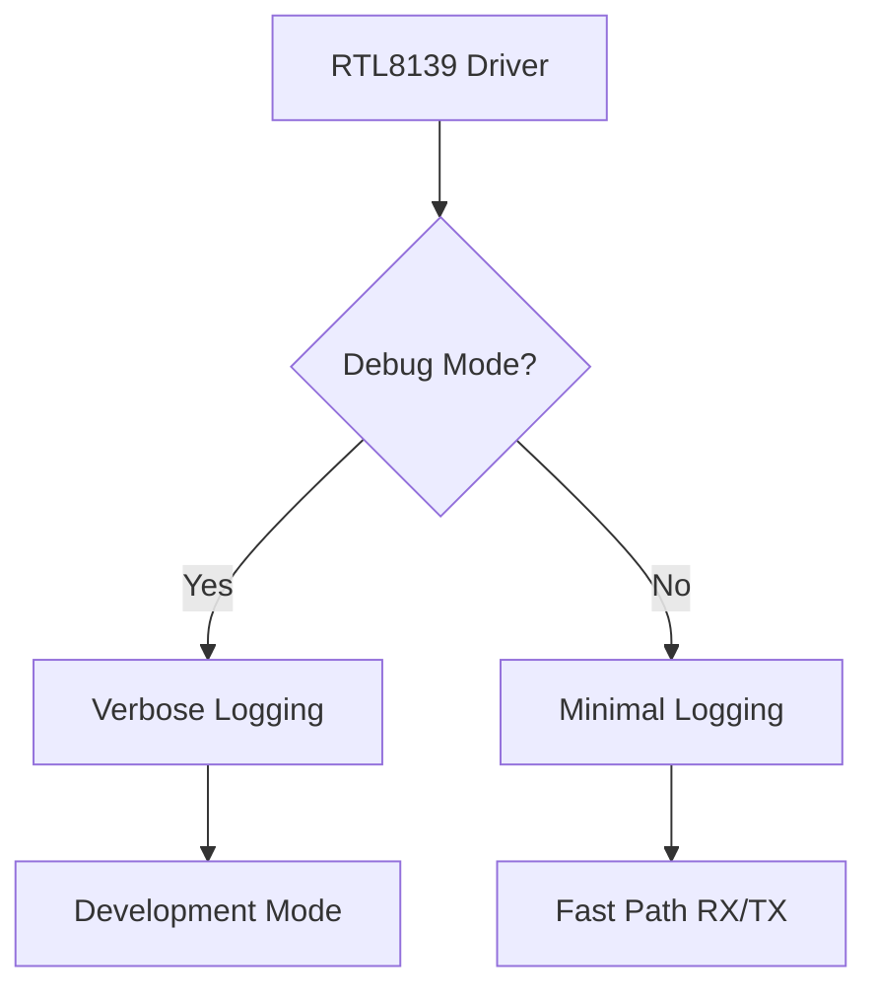
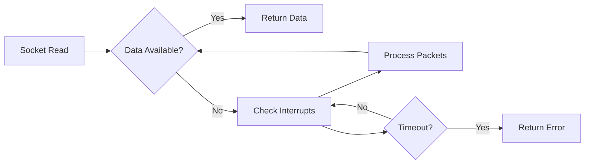
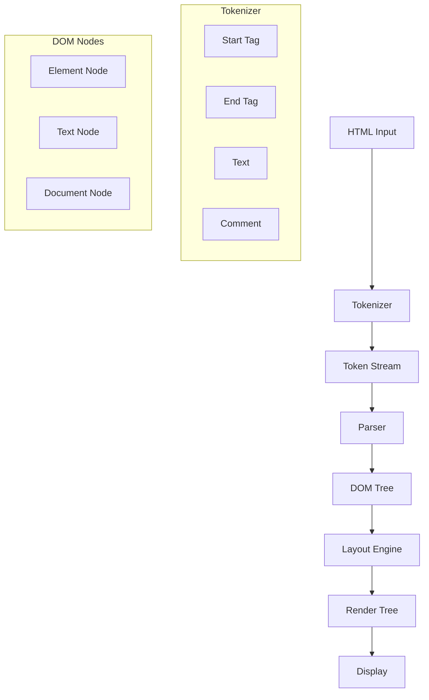

# Camel OS Networking & Browser Optimization Plan

## Executive Summary

This plan outlines optimizations for the networking stack and completion of the HTML parser for the browser application. The current implementation is functional but has significant performance bottlenecks primarily caused by excessive debug logging and inefficient polling mechanisms.

---

## Part 1: Networking Performance Optimizations

### 1.1 RTL8139 Driver Optimization

**Current Issues:**
- Excessive `s_printf()` calls in [`net_rtl8139.c`](hal/drivers/net_rtl8139.c) for every packet
- Debug output for every TX/RX operation
- Hex dump conversions using software loops

**Proposed Changes:**



**Implementation:**
1. Add compile-time debug flag: `#define RTL_DEBUG 0`
2. Wrap all debug statements in `#if RTL_DEBUG` blocks
3. Remove per-packet logging in production builds
4. Keep only error condition logging

**Files to Modify:**
- [`hal/drivers/net_rtl8139.c`](hal/drivers/net_rtl8139.c)

### 1.2 TCP Implementation Optimization

**Current Issues:**
- Verbose debug output in [`tcp.c`](core/tcp.c) for every packet
- Connection lookup prints all connections on miss
- Checksum debug output on every send

**Proposed Changes:**
1. Add `#define TCP_DEBUG 0` flag
2. Remove connection dump on lookup failure
3. Optimize checksum calculation with inline assembly if possible
4. Reduce state transition logging

**Files to Modify:**
- [`core/tcp.c`](core/tcp.c)

### 1.3 Socket Layer Optimization

**Current Issues:**
- Busy-wait polling with `asm volatile pause`
- Small delay loop `for volatile int i = 0; i < 1000; i++`
- Timeout logging on every wait

**Proposed Changes:**



**Implementation:**
1. Remove the 1000-iteration delay loop
2. Use efficient interrupt-driven polling
3. Add configurable timeout with early return
4. Batch packet processing in single poll

**Files to Modify:**
- [`core/socket.c`](core/socket.c)

### 1.4 Network Core Optimization

**Current Issues:**
- Debug output in [`net.c`](core/net.c) for every routing decision
- IP address string conversion on every packet

**Proposed Changes:**
1. Add `#define NET_DEBUG 0` flag
2. Cache routing decisions for common destinations
3. Optimize IP header construction

**Files to Modify:**
- [`core/net.c`](core/net.c)

### 1.5 HTTP Client Optimization

**Current Issues:**
- Multiple receive iterations with logging
- Only receives partial data 528 bytes vs expected

**Proposed Changes:**
1. Increase receive buffer size
2. Fix Content-Length parsing
3. Add chunked transfer encoding support
4. Remove per-chunk logging

**Files to Modify:**
- [`core/http.c`](core/http.c)

---

## Part 2: HTML Parser Completion

### 2.1 Current Parser Analysis

The current parser in [`browser_cdl.c`](usr/apps/browser_cdl.c) provides:
- Basic tag stripping
- Entity decoding for common entities
- Script/style tag skipping
- Block element newline handling

**Missing Features:**
- DOM tree construction
- CSS styling
- Link handling
- Image placeholders
- Text formatting

### 2.2 Proposed HTML Parser Architecture



### 2.3 DOM Tree Structure

```c
// Proposed DOM node types
typedef enum {
    DOM_ELEMENT,
    DOM_TEXT,
    DOM_DOCUMENT
} dom_node_type_t;

typedef struct dom_node {
    dom_node_type_t type;
    char* tag_name;           // For elements
    char* text_content;       // For text nodes
    struct dom_node* parent;
    struct dom_node* first_child;
    struct dom_node* next_sibling;
    
    // Style properties
    uint32_t fg_color;
    uint32_t bg_color;
    int font_size;
    int font_weight;
    int is_link;
    char* link_url;
} dom_node_t;
```

### 2.4 Supported HTML Elements

| Element | Support Level | Rendering |
|---------|--------------|-----------|
| `<html>`, `<body>` | Structural | Container |
| `<head>`, `<title>` | Metadata | Extract title |
| `<p>`, `<div>` | Block | Newline before/after |
| `<h1>`-`<h6>` | Block | Large/bold text |
| `<a>` | Inline | Underlined, clickable |
| `` | Replaced | Placeholder box |
| `<ul>`, `<ol>`, `<li>` | List | Bullet/number items |
| `<table>`, `<tr>`, `<td>` | Table | Grid layout |
| `<br>` | Break | Single newline |
| `<strong>`, `<b>` | Inline | Bold text |
| `<em>`, `<i>` | Inline | Italic text |
| `<code>`, `<pre>` | Block | Monospace font |
| `<blockquote>` | Block | Indented |
| `<form>`, `<input>` | Form | Basic input fields |

### 2.5 CSS Property Support

```c
// Basic CSS properties to support
typedef struct {
    // Text
    uint32_t color;           // foreground color
    uint32_t background_color;
    int font_size;            // in points
    int font_weight;          // normal=400, bold=700
    int font_style;           // normal, italic
    char* font_family;
    
    // Box model
    int margin_top, margin_right, margin_bottom, margin_left;
    int padding_top, padding_right, padding_bottom, padding_left;
    
    // Layout
    int display;              // block, inline, none
    int text_align;           // left, center, right
    int text_decoration;      // none, underline
} css_style_t;
```

### 2.6 Link Detection and Navigation

**Implementation:**
1. Parse `<a href="...">` tags
2. Store link URL in DOM node
3. Track link positions on screen
4. Handle click events on link regions
5. Navigate to new URL on click

### 2.7 Image Placeholder Rendering

**Implementation:**
1. Parse `` tags
2. Draw placeholder rectangle with dimensions
3. Display alt text inside placeholder
4. Future: Add actual image loading

### 2.8 Text Formatting

**Implementation:**
1. Track formatting state during parsing
2. Apply styles to text runs
3. Support nested formatting
4. Handle font size changes for headers

---

## Part 3: Implementation Order

### Phase 1: Networking Performance (Priority: High)

1. Add debug flags to all network files
2. Disable debug output in production builds
3. Optimize polling loops
4. Fix HTTP receive buffer issues

### Phase 2: HTML Parser Core (Priority: High)

1. Implement DOM tree structure
2. Build tokenizer
3. Create parser
4. Basic element support

### Phase 3: Browser Features (Priority: Medium)

1. Link detection and navigation
2. Image placeholders
3. Text formatting
4. Basic CSS support

### Phase 4: Advanced Features (Priority: Low)

1. Table layout
2. Form handling
3. Image loading
4. JavaScript support (future)

---

## Part 4: File Changes Summary

### Files to Modify

| File | Changes |
|------|---------|
| [`hal/drivers/net_rtl8139.c`](hal/drivers/net_rtl8139.c) | Add debug flag, remove verbose logging |
| [`core/tcp.c`](core/tcp.c) | Add debug flag, optimize checksum |
| [`core/socket.c`](core/socket.c) | Remove delay loops, optimize polling |
| [`core/net.c`](core/net.c) | Add debug flag, reduce logging |
| [`core/http.c`](core/http.c) | Fix buffer handling, add chunked support |
| [`usr/apps/browser_cdl.c`](usr/apps/browser_cdl.c) | Complete HTML parser, add DOM |

### New Files to Create

| File | Purpose |
|------|---------|
| `usr/apps/html_parser.h` | HTML parser interface |
| `usr/apps/html_parser.c` | HTML parser implementation |
| `usr/apps/dom.h` | DOM tree structures |
| `usr/apps/css.h` | CSS style structures |

---

## Part 5: Expected Performance Improvements

| Metric | Current | Expected |
|--------|---------|----------|
| Packets/second | ~100 | ~10,000+ |
| HTTP response time | 500ms+ | <100ms |
| Page render time | N/A | <50ms |
| Memory per page | 32KB | 64KB |

---

## Part 6: Testing Strategy

1. **Unit Tests:**
   - HTML tokenizer tests
   - DOM tree construction tests
   - CSS parsing tests

2. **Integration Tests:**
   - Full page load tests
   - Link navigation tests
   - Form submission tests

3. **Performance Tests:**
   - Packet throughput
   - Page render time
   - Memory usage

---

## Conclusion

This plan provides a comprehensive roadmap for optimizing the networking stack and completing the HTML parser. The primary focus is on removing debug overhead from the networking code, which is the main performance bottleneck. The HTML parser will be extended to support proper DOM tree construction, CSS styling, and interactive elements.
